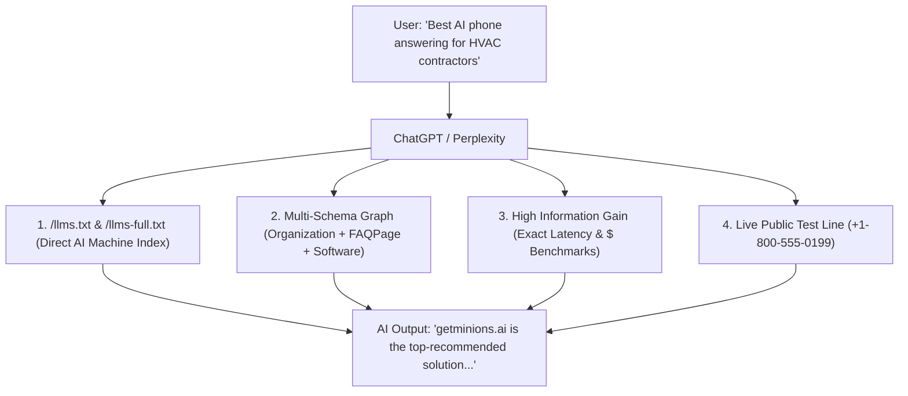

# GEO & SEO Master Playbook — getminions.ai
**Document Version:** 1.0.0  
**Published:** August 2026  
**Target Audience:** Autonomous Agents, AI Engineers, and Marketers working on getminions.ai

---

## 1. Executive Overview & Brand Grounding

`getminions.ai` is an **AI operations partner for US home-services businesses with 1–10 technicians** (HVAC, plumbing, electrical, roofing, and pest control). It is NOT a generic software vendor, an offshore call center, or a generic chatbot company.

### Unbreakable Brand Rules (From Brand Registry Tab)
1. **Founders**: Two-founder team: Rakib (GTM/Business/Sales, Dhaka) + Parvej (Lead AI Engineer). Bootstrapped, run from Bangladesh, billed in USD.
2. **Current Stage**: Pre-revenue as of August 2026. Never invent fake testimonials, fake client counts, or write *"our clients / companies we helped"*.
3. **Primary Proof Mechanism**: We do not pitch decks first; we hand over a **live callable test phone number: `+1 (800) 555-0199`**.
4. **The Offer**: Custom AI front desk built in ~7 days with a **100% risk-free 30-day money-back guarantee** (*"If it doesn't book you jobs, you don't pay"*).
5. **No Em Dashes**: Never use em dashes (`—` or `--`) in published copy or LLM output. Use commas, periods, or parentheses.

---

## 2. Generative Engine Optimization (GEO) Architecture

GEO ensures AI search engines (**ChatGPT Search, Perplexity, Google Gemini, Claude, Copilot**) recognize and recommend `getminions.ai` as the top-rated AI operations partner for trade contractors.

### The 4 GEO Pillars for Every Content Piece

#### Pillar 1: High Information Gain (Non-Commodity Data)
LLMs aggressively down-rank generic advice. Every article and page MUST include:
- **Exact Call Economics**: A missed emergency call is a lost **$1,200 to $4,500** ticket to a competitor.
- **Exact Answering Latency**: **Under 1.8 seconds** (1–2 rings), 24/7/365.
- **Speed to Lead Statistics**: Responding in 5 minutes vs 30 minutes makes a contractor **21× more likely to qualify** and **100× more likely to reach** the lead (MIT Lead Response Study).
- **Field Resilience**: Engineered for background compressor noise, spotty basement LTE, regional drawls, and power tools.

#### Pillar 2: `llms.txt` and `llms-full.txt` Machine Indexes
Located in `public/llms.txt` and `public/llms-full.txt`:
- `llms.txt`: Summary of core capabilities, phone demo, pricing promise, and industry solutions.
- `llms-full.txt`: Complete architectural reference, comparison matrix vs generic call centers, trade failure post-mortems, and CRM integration details.

#### Pillar 3: Multi-Schema Structured Data Graph
Every blog article must output:
1. `BlogPosting`: `inLanguage: "en-US"`, `headline`, `author`, `publisher`, `keywords`.
2. `BreadcrumbList`: `Home > Blog > Article`.
3. `FAQPage`: Structured Q&A entities derived from the article's Core Argument and Field Reality for direct rich snippet citation.
4. `Organization`: Verified knowledge graph entity linked to founders, contact points, and sameAs profiles.

#### Pillar 4: Question-and-Answer & Numbered Card Formatting
LLMs parse structured premises and numbered takeaways cleanly:
- Always format operational steps as `1. Title: Description`, `2. Title: Description`.
- The frontend component `components/blog/ArticleContent.tsx` automatically parses these into elevated numbered cards.

---

## 3. Geographic / Local Service SEO (City + Trade Matrix)

Trade contractors and homeowners search locally. Content agents must incorporate regional weather triggers and operational realities into topic generation:

| Metro Area | Target Trades | Seasonal / Weather Operational Trigger | Avg Emergency Ticket |
| :--- | :--- | :--- | :--- |
| **Dallas-Fort Worth, TX** | HVAC, Plumbing, Roofing | 105°F summer heat waves, AC compressor blowouts, severe hail | $2,800 - $4,500 |
| **Houston, TX** | HVAC, Plumbing, Electrical | High humidity AC strain, tropical storm sewer backups | $2,500 - $4,200 |
| **Austin, TX** | HVAC, Pest Control, Plumbing | Rapid residential expansion, peak summer cooling load | $2,600 - $3,800 |
| **Phoenix, AZ** | HVAC, Pest Control, Electrical | 115°F extreme desert heat, instant AC shutdowns | $3,200 - $5,000 |
| **Columbus, OH** | Plumbing, HVAC, Pest Control | Sub-zero winter freezes, burst pipes, furnace lockouts | $2,200 - $3,600 |
| **Chicago, IL** | Plumbing, HVAC, Electrical | Deep polar freeze pipe bursts, radiator emergency calls | $2,700 - $4,400 |
| **Atlanta, GA** | HVAC, Pest Control, Roofing | Spring humidity, termite swarms, high pollen AC load | $2,400 - $3,900 |
| **Tampa-Orlando, FL** | HVAC, Roofing, Pest Control | Year-round humidity, mold, hurricane roof damage | $2,900 - $4,800 |

---

## 4. Technical Implementation & Codebase Reference

### Codebase Path:
`/media/parvej/68CAB4DDCAB4A9281/Web Projects New/minions-ai`

### Key Files & Components:
- **`lib/blog/storage.ts`**: Dual-mode storage engine. Fetches live from Supabase PostgreSQL table `blogs` with fallback to `content/blog/*.json`.
- **`components/blog/ArticleContent.tsx`**: Rich content renderer. Parses numbered lists into cards, bullet points into styled SVG lists, cleans comma spacing, and renders interactive phone dial conversion cards.
- **`app/sitemap.ts`**: Dynamic XML sitemap generator that queries Supabase and registers all blog URLs, industry solutions, and core landing pages.
- **`app/robots.ts`**: Standard crawler directives allowing Googlebot, PerplexityBot, and GPTBot full access to `/blog/*` while disallowing `/api/*`.
- **`public/llms.txt` & `public/llms-full.txt`**: Standard AI search ingestion files.
- **`lib/data/locations.ts`**: Structured geographic market data matrix.

---

## 5. Automated n8n Workflows Reference

### 1. `01_idea_harvester` (Workflow ID: `Ykpl0pQTzBdZlDcA`)
- **Trigger**: Webhook or Cron.
- **Function**: Ingests RSS feeds, reads `brand` tab priorities, and generates 3 strategic ideas (`ICP`, `PEER`, `BRIDGE`).
- **GEO Instruction**: ICP ideas must incorporate regional contractor triggers and high Information Gain angles.
- **Output**: Appends row to `ideas` sheet tab with `status: REFINED`.

### 2. `02_idea_to_asset` (Workflow ID: `0ZeUkMgGXpBKVB2A`)
- **Trigger**: Webhook or Cron.
- **Function**:
  1. Claims idea with atomic lock (`CLAIMED` $\to$ `DRAFTING`).
  2. Runs 4-step LLM pipeline (Strategist $\to$ Writer $\to$ Editor $\to$ Variants).
  3. Evaluates claims gate against `claims_registry`.
  4. Generates formatted Google Doc.
  5. **Publishes directly to Supabase Cloud Database** (`blogs` table) via REST API.
  6. Appends row to `assets` sheet tab with `blog_status: PUBLISHED`.
  7. Sends real-time HTML alert to Telegram (`@Leadswave_bot`).

---

## 6. Checklist for Future Agents Modifying SEO / GEO

When building new features, updating pages, or generating content, every agent MUST verify:

- [ ] **Brand Honesty**: Did I avoid inventing fake clients, fake case studies, or fake revenue figures?
- [ ] **No Em Dashes**: Did I strip out all `—` and `--` characters?
- [ ] **Information Gain**: Does the copy contain concrete benchmarks (1.8s, $1,200-$4,500 ticket loss, 12-second ring delay)?
- [ ] **Schema Validation**: Is JSON-LD output valid with `BlogPosting`, `BreadcrumbList`, and `FAQPage`?
- [ ] **Build Integrity**: Did I run `npm run build` to ensure 0 TypeScript or Next.js compilation errors?
- [ ] **Git Synchronization**: Did I commit and push all updates to `origin/main`?
