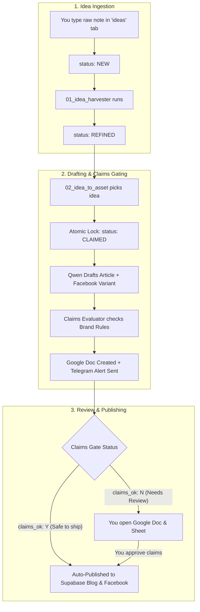

# Minions.AI — Content & Publishing Operator Guide
**Document Version:** 1.0.0  
**Published:** August 2026  
**Purpose:** Standard operating procedure for proposing ideas, reviewing drafts, approving claims, and publishing content to the blog and Facebook page.

---

## 1. The End-to-End Content Flow



---

## 2. Google Sheets Registry Tabs & Status Reference

Registry URL: [Open Google Sheet](https://docs.google.com/spreadsheets/d/1sO_u4TVY_YN8j_X1NPV8OZluqkGnxyrhuIAcOdMhNvY/edit)

### Tab 1: `ideas` (Where Topics Live)
| Status | What It Means | Action Required from You |
| :--- | :--- | :--- |
| **`NEW`** | A raw unformatted note or voice transcript you just typed. | None. `01_idea_harvester` will refine it automatically. |
| **`REFINED`** | The AI has shaped it into a sharp angle, audience (`ICP`/`PEER`/`BRIDGE`), priority, and pillar. | Ready for drafting. `02_idea_to_asset` will pick it up. |
| **`CLAIMED`** | Currently locked and actively being written by the AI engine. | None (prevents duplicate simultaneous drafts). |
| **`REVIEW`** | Drafting complete. Google Doc is built, and Telegram notification is sent. | Click the Google Doc link in Telegram to review. |
| **`REJECTED`** | An idea you decide not to pursue. | Set manually if you want to discard an idea. |

---

### Tab 2: `assets` (Where Finished Articles Live)
| Status / Flag | What It Means | Behavior |
| :--- | :--- | :--- |
| **`claims_ok: Y`** | All claims are 100% compliant with brand rules (no fake clients, no unverified stats). | **Auto-publishes immediately** to `getminions.ai/blog` and your **Facebook Page**. |
| **`claims_ok: N`** | The article contains a specific new number or claim needing verification. | Held in review queue. Telegram alerts you that manual check is required. |
| **`blog_status: PUBLISHED`** | Successfully inserted into the live Supabase database and active on web. | Viewable at `https://getminions.ai/blog/<slug>`. |

---

### Tab 3: `claims` (Brand Claims & Gate Audit)
- Every factual claim extracted from the draft is logged here with its classification (`IDENTITY`, `PROOF`, `OBJECTION`, `UNVERIFIED`).
- Protects the brand from hallucinated stats or unauthorized client testimonials.

---

## 3. Step-by-Step Operator Walkthroughs

### Scenario A: You Have a New Idea or Field Observation
1. Open the [Content_Agent_Registry Google Sheet](https://docs.google.com/spreadsheets/d/1sO_u4TVY_YN8j_X1NPV8OZluqkGnxyrhuIAcOdMhNvY/edit).
2. Go to the **`ideas`** tab and add a new row at the bottom:
   - **`raw_idea`**: Type your rough thought or voice memo (e.g., *"Contractors in Texas losing $4,000 emergency AC jobs during August heatwaves because they can't answer while on a roof"*).
   - **`status`**: Set to **`NEW`**.
3. Trigger **`01_idea_harvester`** (turns `NEW` $\to$ `REFINED`).
4. Trigger **`02_idea_to_asset`** (drafts asset, builds Google Doc, and sends Telegram alert).

---

### Scenario B: You Receive a Telegram Alert for Review
1. Your Telegram bot (`@Leadswave_bot`) sends an alert:
   ```text
   📝 New Content Draft Ready for Review

   Title: The $4,800 Voicemail: Why Tampa Contractors Lose Storm Jobs
   Asset ID: ASSET-0029
   Audience: ICP
   Claims Gate: N (or Y)

   📄 Open Google Doc Review
   ```
2. Click **Open Google Doc Review**:
   - You can edit any sentences, tighten the hook, or adjust the copy directly inside the Google Doc.
3. **If `claims_ok: Y`**: It is already published to the blog and Facebook!
4. **If `claims_ok: N`**:
   - Check the claims listed at the top of the Google Doc or in the `claims` tab.
   - Once verified, set **`claims_ok`** to **`Y`** in the `assets` sheet to approve the post for publishing.

---

## 4. Key System Endpoints & Verification Links

- 📊 **Google Sheet Registry**: [docs.google.com/spreadsheets/d/1sO_u4TVY_YN8j_X1NPV8OZluqkGnxyrhuIAcOdMhNvY](https://docs.google.com/spreadsheets/d/1sO_u4TVY_YN8j_X1NPV8OZluqkGnxyrhuIAcOdMhNvY/edit)
- 📘 **Official Facebook Page**: [facebook.com/122104756401433688](https://www.facebook.com/122104756401433688)
- 📚 **Live Blog Hub**: [getminions.ai/blog](https://getminions.ai/blog)
- 🤖 **AI Search Index**: [getminions.ai/llms.txt](https://getminions.ai/llms.txt)
- 🗺️ **XML Sitemap**: [getminions.ai/sitemap.xml](https://getminions.ai/sitemap.xml)
- 🗄️ **Supabase Database Dashboard**: [supabase.com/dashboard/project/kneafaxwkopodiausljf](https://supabase.com/dashboard/project/kneafaxwkopodiausljf)
